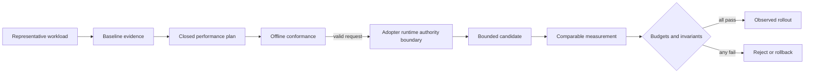

# Performance v1 architecture

`wellmanifest/performance` owns the portable decision contract. Repositories
adopt an immutable revision and keep host-specific execution in their runtime.

The plan layer has no subprocess, network, credential or deployment authority.
The adopter owns scheduling, cgroups, containers, probes and file placement.
Evidence is connected by immutable URI and SHA-256 digest, never by an API token
in a URL.

Four adapters map the contract to local mechanisms:

1. repository adapters update tool/IDE/local Git/Docker exclusions;
2. workstation adapters use scheduler, CPU and I/O controls;
3. service adapters apply budgets, coalesced caches and bounded probes;
4. data adapters use tail reads, offsets or indexes for append-only streams.

All adapters preserve source, configuration, security and behavioral
invariants. The runtime records a receipt; the standard never claims the effect.

